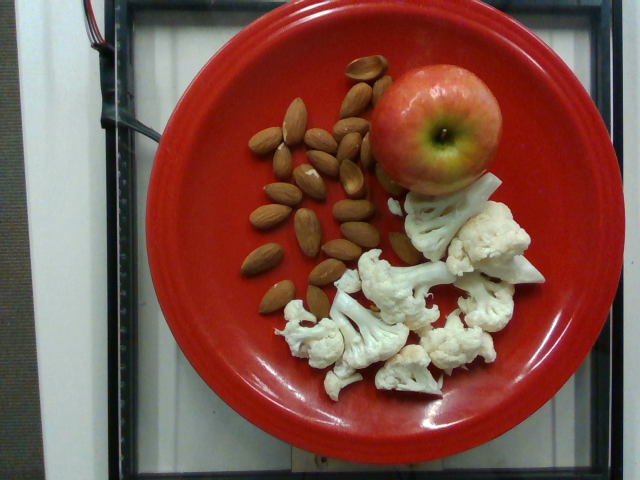
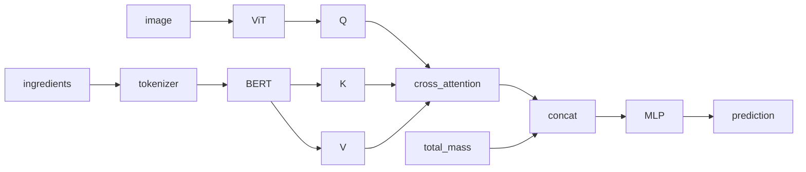

# CaloricContent - Нейросеть для предсказания калорийности блюд

[Артефакты моделирования и контрльная точка модели](https://drive.google.com/drive/folders/1McRWbnVx84nDDhuhrzdCw7oyNSvCX1Ec?usp=sharing)

**Задача** - создать и обучить нейросеть, которая будет предсказывать калорийность блюд.

**Данные** - датасет, содержащий фотографии блюд, списки ингридиентов, массу и калорийность
каждого блюда.

**Целевая переменна** - калорийность блюда.

**Целевая метрика** - $MAE < 50$

**Достигнутое значение целевой метрики** $MAE \approx 40$ на тестовом множестве.

## Пример входных данных

Изображение:  


Список ингредиентов:
```
apple, cauliflower, almonds
```

Дополнительные данные:
- `Image zie`: (640, 480)
- `Total calories`: 292.64
- `Total mass`: 265.0

## CLI

В проект добавлен интерфейс командной строки.

### Вывод справки

```shell
poetry run python python src/caloric_content/cli.py --help
```

### Запуск тренинга

```shell
poetry run python python src/caloric_content/cli.py train
```

### Тестирование модели

```shell
poetry run python python src/caloric_content/cli.py test <Путь к контрольной точке>
```

## Описание решения

### Структура модели

Для обучения модели будем использовать все три модальности:
- изображение (фотография блюда),
- текст (рецепт),
- число (масса).

Для обработки изображений будем использоать
[`google/vit-base-patch16-224`](https://huggingface.co/google/vit-base-patch16-224),
а для обработки текстов
[`google-bert/bert-base-uncased`](https://huggingface.co/google-bert/bert-base-uncased),
объединять эмбеддинги изображений и текстов будем с помощью кросс-модального
внимания. В качестве регрессора используем двуслойный MLP.

Основные элементы модели показаны на следующей диаграмме:



Интуиция следующая:
- фотографии содержат основную информацию о блюде, поэтому эмбедиинги ViT являются
запросом для кросс-модального внимания;
- текст дополняет фотографии, так как может содержать информацию о скрытых калориях,
например подсолнечном масле,
- масса блюда конкатенируется с выходом кросс-модального внимания и поступает на вход
регрессора, у ViT могут возникнуть сложности с оценкой объёма пищи, несмотря на то,
что все фотографии сделаны в одном масштабе, масса нужна, "подсказать" модели объём;
- предполагается что коросс-модальное внимание позволит связать ингридеенты с
конкретными участками изображения (спрашиваем механизм внимания "что изображено
на данном патче?").

Тренинг модели выполняем следующим образом:
- BERT полностью заморожен - EDA показал, что текста мало, и текст бедный. Есть риск
получить оверфитинг, если тренировать BERT.
- Обучаем последние 4 слоя ViT с learning rate 1e-5.
- Обучаем регрессор с learning rate 1e-4.


### Аугментации данных

#### Изображения (Albumentations)

Из-за того что в модели используется предобученный ViT нежелательно изменять
пропорции изображений, поэтому будем будем уменьшать изображение с сохранением
пропорций и добавлять падинг. 

Пайплайн аугментаций для тренинга будет следующим:
1. LongestMaxSize
1. PadIfNeeded
1. RandomCrop
1. HorizontalFlip
1. VerticalFlip
1. RandomRotate90
1. Affine
1. CoarseDropout
1. ColorJitter
1. Normalize
1. ToTensorV2

Пайплайн аугментаций для теста и инференса будет следующим:
1. LongestMaxSize
1. PadIfNeeded
1. CenterCrop
1. Normalize
1. ToTensorV2

Подробнее в `config.yaml`.


### Текст

Для дополненеия тестовых данных во время тренинга будем
- перемешивать порядок следования ингредиентов,
- удалять чатсть ингредиентов.

Во время теста и инференса будем подавать в модель текст без изменений.
Подробнее в `config.yaml`.

### Числовые данные (масса)

Во время обучения к стандартизованной массе будем добавлять небольшую нормально
распределённую случайную величину. Во время теста и инференса будем подавать
на вход модели стандартизованное значение массы без дополнительных искажений.
